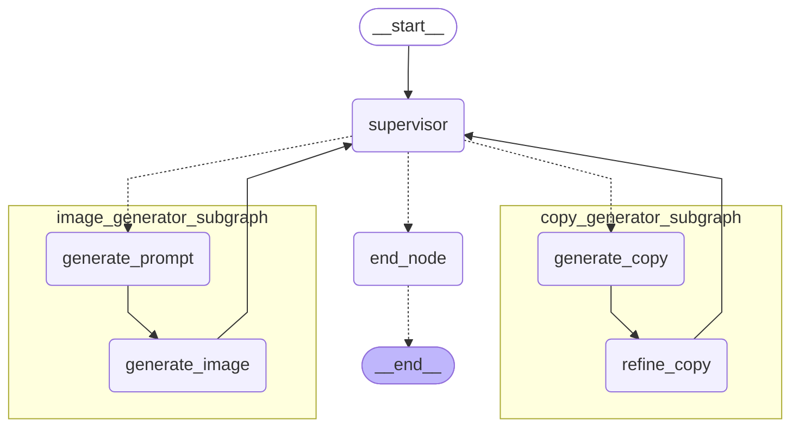

# LangGraph×Bedrockによる複数のAgentic Workflowを利用したSupervisor型マルチエージェントの実装：広告素材作成アプリケーション

:::note info
本記事は[Bedrock Night オンライン 〜AWSで生成AIアプリ開発！ 最新ナレッジ共有〜](https://jawsug.connpass.com/event/345497/)で登壇した際の内容です。以下の登壇資料も合わせてご覧ください！
:::

https://speakerdeck.com/ren8k/langgraph-bedrock-supervisor-agent

## はじめに
株式会社NTTデータ デジタルサクセスコンサルティング事業部の[@yamato0811](https://qiita.com/yamato0811), [@ren8k](https://qiita.com/ren8k)です。

業務の中で、LangGraphを用いたMulti-Agentについて調査・実装する機会があり、複数のAgentic Workflowを組み合わせたMulti-Agentアプリケーションの開発を行いました。
そこで、本記事では、広告素材（コピー文、画像）作成アプリケーションを例に、Multi-Agentにおける主要な技術要素や、実際に開発を進めるうえで得られた知見・ノウハウをお伝えします。

StreamlitとLangGraphを使ったMulti-Agentアプリケーションの実装事例はまだ少なく、試行錯誤の連続でした。本記事では、実装を通じて得られた技術的なポイントや実践的な工夫を、Python実装と共に解説します。これらの情報が、同様の開発に取り組まれる方々の一助となれば幸いです。

解説用に実装した簡易アプリケーションのリポジトリは、以下のリンクからご確認いただけます。

https://github.com/yamato0811/streamlit-langgraph-multi-agent.git

また、StreamlitとLangGraphで実装したHuman-in-the-loop Agentic Workflowについて解説した記事を、以前に執筆しました。まだご覧になっていない方は、そちらを合わせてお読みいただくとより理解が深まるかと思います！

https://qiita.com/yamato0811/items/02688690a85a670b773f

本内容は、弊社でのAWS Japan生成AI実用化推進プログラムでの取り組みの一環です。プログラムにおける取り組み内容は、以下のnoteにて外部発信していますのでぜひご覧ください！

https://note.com/digitalsuccess/n/n958487f4d1cf


## 想定読者
- Streamlitを用いたアプリケーション開発経験がある方
- LangGraphの概要を理解している方
- LangGraphでのMulti-Agent実装に興味がある方


## Agentic Workflow vs Agent
AI Agentの開発においては、「Agentic Workflow」と「Agent（ReAct）」という2つの主要なアプローチがあります。それぞれの特徴と違いを理解し、適切な場面で使い分けることが重要です。

### Agentic Workflow
Agentic Workflowは、事前に明確に定義された実行順序で、複数のタスク（LLMやツール）を順番に実行する仕組みです。このアプローチの利点は、最終的な出力が一貫性を持ちやすく、正確であることです。


各タスクの実行順序は予め決められているため、プロセスが制御しやすく、結果も安定しやすいのが特長です。

### Agent
Agent（ReAct）は、状況に応じてLLMがどのツールを使うべきかを自律的に決定し、ツールの実行結果をもとに次のアクションを柔軟に選択する仕組みです。この仕組みでは、LLMが考え、行動し、その結果を観察して再び考える（Reasoning, Acting, Observation）というサイクルを繰り返します。


実行タスクやその実行順序を動的に決定できるため、ユーザーのニーズに対し柔軟に対応可能です。

### Agentic WorkflowとAgentの比較

Agentic Workflowはプロセスが明確で制御が容易な反面、状況変化への対応力や柔軟性に欠けることがあります。一方で、Agent（ReAct）は柔軟な判断が可能なため、予測不能な状況や、複雑で柔軟な対応が求められるシナリオで効果を発揮します。ただし、Agentはその柔軟性ゆえに動作が予測しづらく、調整やチューニングが必要な場合があります。

|項目| Agentic Workflow| Agent（ReAct）|
|-|-|-|
| 回答の一貫性| ◯ タスク実行順序は決定的で制御しやすい| △ 想定通りのタスクの実行順序になるとは限らない |
| 全体的なレイテンシー | ◯ タスクを直列に実行するのみ | △ タスク（Tool）実行の度にLLMの思考がある |
| 柔軟性 | △ 一部のタスクのみを実行することはできない | ◯ LLMが実行すべきタスクや実行順序を動的に決定する |
| 機能追加の容易性 | △ フローが複雑になるほど実行コストが高い（タスク間の依存関係の管理など） | ◯ Toolを利用するのみで、改修範囲は狭い |

:::note info
Agentic WorkflowやAgentについては、Anthropicの技術記事[Building effective agents](https://www.anthropic.com/engineering/building-effective-agents)やLangGraphのドキュメント[Agent architectures](https://langchain-ai.github.io/langgraph/concepts/agentic_concepts/)の記事が大変参考になります。
:::

## Multi-Agent
AI Agentが管理するツールの増加や、AI Agentへの指示の複雑化により、単一のエージェントでの対応が困難になる場合があります。そのような状況で有効な解決策となるのがMulti-Agentのアプローチです。
Multi-Agentシステムでは、専門分野に特化した複数のSub Agentが協調して動作するので、複雑なタスクを処理することが可能です。

### Multi-Agentの利点
- 各Agentのモジュール化により、Agentごとに開発・テスト・管理が容易になる
- 特定の領域に特化した専門Agentを構築でき、システム全体のパフォーマンスが向上する
- エージェント間の通信方法を明確に制御できる

### Multi-Agentの構成パターン
Multi-Agentの構成にはいくつかのパターンが存在します。

1. **ネットワーク型**：全てのエージェントが互いに自由に通信でき、どのエージェントも次にどのエージェントを呼ぶか決定できる
2. **Supervisor型**：各Agentが単一のSupervisor Agentと通信し、Supervisorが次の呼び出しAgentを決定する
3. **Supervisor（ツール型）**：Agentをツールとして扱い、Supervisor Agentがツール呼び出し可能なLLMを使って、どのエージェントを呼ぶか、および引数を決定する
4. **階層型**：Supervisorの上位にさらに別のSupervisorを置くことで、階層構造を作り管理を効率化する
5. **カスタム型**：特定のニーズに応じてエージェント同士の接続を自由に定義する


> 上記図や整理内容はLangGraphドキュメントの[Multi-agent Systems](https://langchain-ai.github.io/langgraph/concepts/multi_agent/)から引用しています。


## 作成したアプリケーション
広告の「キャッチコピー文」と「画像」を生成するSupervisor型のMulti-Agentアプリケーションを実装しました。ユーザーが広告に使用する素材の作成を要望すると、Supervisorが各Sub Agent（キャッチコピー生成Agent, 画像生成Agent）を適切に呼び出し、目的に応じた広告素材を作成する仕組みとなっています。


Python実装は以下に公開しています。LLMとしてAmazon BedrockのClaude 3.7 Sonnetを、画像生成AIとしてAmazon BedrockのAmazon Nova Canvasを利用しています。

https://github.com/yamato0811/streamlit-langgraph-multi-agent.git

### WorkflowをMulti-Agentで利用するアイデア
WorkflowとMulti-Agentの両方のメリットを享受するため、Multi-Agentの各Agent（Sub Agent）としてAgentic Workflowを利用しました。これにより、ユーザーの要望を基に実行すべきWorkflowを柔軟に選択しつつ、決定的な実行順序で正確なタスク実行が可能となります。


上記のアイデアを実現するために、LangGraphの以下の機能を利用しています。

- SubGraph: グラフ（Agentic Workflow, Agent）をノードとして利用する機能
- handoff(Command): Agentの制御を他のAgentに譲渡する機能

:::note info
工夫点として、handoff(Command)を`@tool`デコレータを使用して実装することで、Sub Agentを（間接的に）ツールとして定義しています。これにより、SupervisorからTool UseでSub Agentを呼びすことが可能です。
:::

### LangGraphのグラフ構造
以下に、今回作成したアプリケーションのグラフ構造を示します。




### アプリの機能
Supervisorは以下2つの機能を持つSub Agentを管理しており、ユーザーからの要望に応じて各Sub Agentに指示を出します。

- **コピー文生成エージェント**: 与えられたキーワードをもとに効果的なコピー文を作成する
  - generate_copyノード：Supervisorが指示したキーワードに基づいて初期コピー文を生成
  - refine_copyノード：生成した初期コピー文をさらに改善
- **画像生成エージェント**: 画像の主題に基づいて、画像を生成する
  - generate_promptノード：Supervisorが指示した画像の主題に基づいて画像生成用のプロンプトを作成
  - generate_imageノード：作成したプロンプトを元に画像を生成


## LangGraphでMulti-Agentの実装
本章では、LangGraphを使用したAgentグラフの実装方法について、具体的なコード例を交えて説明します。特に、Sub AgentとしてWorkflowを定義するために利用した、**SubGraph**と、**handoff(Command)** という機能を中心に解説します。

※ プログラムの一部のみ抜粋していますので、適宜[GitHubのコード](https://github.com/yamato0811/streamlit-langgraph-multi-agent)を参照ください。

### Stateの定義
グラフのノード間を遷移するState情報は`agent/state.py`に以下のように定義しています。  

`display_message_dict`は、Streamlitに表示するためのメッセージをまとめたものです。各ノードでこの内容を更新することで、各ノードの実行結果をStreamlit上に表示します。

```python: agent/state.py
from langgraph.graph.message import add_messages
from typing_extensions import Annotated, Literal, NotRequired, TypedDict


class DisplayMessageDict(TypedDict):
    role: Literal["user", "assistant"]
    title: str
    icon: str
    content: str
    images: NotRequired[list[str]]


class AgentState(TypedDict):
    messages: Annotated[list, add_messages]

    # Copy Generator
    theme_copy: str
    draft_copy: str

    # Image Generator
    visual_concept: str
    img_prompt: str

    # for Streamlit Display
    display_message_dict: DisplayMessageDict
```

:::note info
`messages: Annotated[list, add_messages]`の`​add_messages`はリデューサーと呼ばれ、状態（State）の更新時の処理を指定する際に利用します。`​add_messages`はLangGraphにおける組み込みの関数で、状態（State）内のメッセージリストを更新する際、上書きせずにリストに追加（append）することが可能です。
https://langchain-ai.github.io/langgraph/tutorials/introduction/#part-1-build-a-basic-chatbot
:::


### SubGraph
Workflowで構成した各Sub Agentを階層的に管理するため、SubGraphの機能を使用しました。SubGraphを使用することで、グラフ全体の管理性や拡張性を高めることが可能となります。

#### Supervisorの定義
`agent/supervisor.py`でSupervisorのグラフを構築しています。まず、`__init__`関数で、Supervisorが利用するツールの設定を行います。グラフの定義およびコンパイル処理は、`build_graph`関数で行っています。

すでにコンパイル済みのグラフ（`copy_generator`や`image_generator`）を直接ノードとして`add_node`することで、Agentic Workflowをサブグラフとして利用することができます。

:::note warn
ツールとして、handoffによりサブエージェントに制御を譲渡するための関数（`handoff_to_copy_generator`や`handoff_to_image_generator`）を定義しています。これら解説については、後述の[セクション](#handoffcommand)で詳しく行います。
:::

```python: agent/supervisor.py
import json

from langgraph.checkpoint.memory import MemorySaver
from langgraph.graph import END, StateGraph
from langgraph.graph.state import CompiledStateGraph
from langgraph.types import Command
from typing_extensions import Literal

from agent.copy_generator import CopyGenerator
from agent.image_generator import ImageGenerator
from agent.state import AgentState
from agent.tools import handoff_to_copy_generator, handoff_to_image_generator
from models.llm import LLM


class Supervisor:
    def __init__(
        self, llm: LLM, copy_generator: CopyGenerator, image_generator: ImageGenerator
    ) -> None:
        self.tools = [handoff_to_copy_generator, handoff_to_image_generator]
        self.tools_by_name = {tool.name: tool for tool in self.tools}
        self.llm_with_tools = llm.model.bind_tools(self.tools)
        self.checkpointer = MemorySaver()
        self.graph = self.build_graph(copy_generator, image_generator)

    def build_graph(
        self, copy_generator: CopyGenerator, image_generator: ImageGenerator
    ) -> CompiledStateGraph:
        graph_builder = StateGraph(AgentState)
        graph_builder.add_node(self.supervisor)
        graph_builder.add_node("copy_generator_subgraph", copy_generator.graph)
        graph_builder.add_node("image_generator_subgraph", image_generator.graph)
        graph_builder.add_node(self.end_node)
        graph_builder.add_edge("copy_generator_subgraph", "supervisor")
        graph_builder.add_edge("image_generator_subgraph", "supervisor")
        graph_builder.set_entry_point("supervisor")
        return graph_builder.compile(checkpointer=self.checkpointer)
```

:::note info
サブグラフを追加する際は、サブグラフの状態（state）のスキーマにおけるプロパティを1つ以上、共有キーとして親グラフのstateに含める必要があります。これは、共有キーを介して親グラフとサブグラフの状態を連携させるためです。
もし親グラフと全く異なるスキーマ（共有キーなし）を定義したい場合は、サブグラフを呼び出すノード関数を定義する必要があります。

https://langchain-ai.github.io/langgraph/how-tos/subgraph/
:::

#### Sub Agentの定義
Sub Agentのグラフの代表例として、CopyGeneratorのSubGraphについて説明します。
CopyGeneratorは、キャッチコピーの生成を行うノード（`generate_copy`）とコピーの改善を行うノード（`refine_copy`）を定義したAgentic Workflowです。

このSubGraphは単純な直線的な構造で、generate_copyからrefine_copyへと順番に処理を進めます。

:::note info

最終的にSupervisorに制御が移るように、以下のようにSupervisorのグラフ内で定義しています。

```python
graph_builder.add_edge("copy_generator_subgraph", "supervisor")
```

:::

```python: agent/copy_generator.py
from langgraph.graph import StateGraph
from langgraph.graph.state import CompiledStateGraph

from agent.state import AgentState
from models.llm import LLM


class CopyGenerator:
    def __init__(self, llm: LLM) -> None:
        self.llm = llm
        self.graph = self.build_graph()

    def build_graph(self) -> CompiledStateGraph:
        graph_builder = StateGraph(AgentState)
        graph_builder.add_node(self.generate_copy)
        graph_builder.add_node(self.refine_copy)

        graph_builder.set_entry_point("generate_copy")
        graph_builder.add_edge("generate_copy", "refine_copy")
        graph_builder.set_finish_point("refine_copy")
        return graph_builder.compile()
```

CopyGeneratorの各ノードの処理関数は以下のように記載しています。

`generate_copy()`では、Supervisorから受け取ったコピーのテーマ`state['theme_copy']`を基にLLMを実行し、キャッチコピーを生成します。生成結果は`draft_copy`として返します。`refine_copy()`では、`generate_copy()`で生成した`draft_copy`を受け取り、LLM実行により改善したコピーを返します。

また、`display_message_dict`には、Streamlitに表示するためのメッセージを格納しています。

```python: agent/copy_generator.py
    def generate_copy(self, state: AgentState) -> dict:
        response = self.llm(
            [
                (
                    "system",
                    "あなたはプロのコピーライターです。",
                )
            ]
            + [
                (
                    "human",
                    f"""以下のテーマで、キャッチコピーを1つ生成してください。必ず結果のみ出力してください。
                    <theme_copy>
                    {state['theme_copy']}
                    </theme_copy>
                    """,
                )
            ]
        )

        display_message_dict = {
            "role": "assistant",
            "title": "Copy Generatorの生成結果",
            "icon": "📝",
            "content": response.content,
        }

        return {
            "messages": response,
            "draft_copy": response.content,
            "display_message_dict": display_message_dict,
        }

    def refine_copy(self, state: AgentState) -> dict:
        response = self.llm(
            [
                (
                    "system",
                    "あなたはプロのコピーライターです。",
                )
            ]
            + [
                (
                    "human",
                    f"""多角的な観点で、以下のキャッチコピーを改善してください。必ず結果のみ、改善した1つのコピーだけ出力してください。
                    <draft_copy>
                    {state['draft_copy']}
                    </draft_copy>
                    """,
                )
            ]
        )

        display_message_dict = {
            "role": "assistant",
            "title": "Copy Generatorの改善結果",
            "icon": "📝",
            "content": response.content,
        }

        return {
            "messages": response,
            "display_message_dict": display_message_dict,
        }
```


### handoff(Command)

handoffは、あるAgentが別のAgentに制御を渡す考え方のことで、LangGraphのCommandという機能を利用して実現する事ができます。

#### Supervisorの処理関数の実装
Supervisorの`supervisor()`関数では、tool useとhandoffを使用して、Supervisor Agentが他のサブエージェントに処理を委譲する（サブエージェントをツールとして呼び出す）仕組みを実装しています。

まず、Supervisorは、過去の会話履歴とユーザーからの指示に基づき、次にどのサブエージェント（ツール）を利用すべきかを判断します。その際、応答（`response`）は会話のコンテキストとして`state["messages"]`に追加しています。

```python: agent/supervisor.py
def supervisor(self, state: AgentState) -> Command[
    Literal["copy_generator_subgraph", "image_generator_subgraph", "end_node"]
]:
    response = self.llm_with_tools.invoke(
        [
            (
                "system",
                """
                あなたは、Sub Agentの会話を管理する役割を持つ監督者です。
                ユーザーのリクエストに基づき、どのSub Agentを指示するか（どのツールを呼び出すか）を決定します。
                ツール呼び出しの必要がない場合は、ユーザーのサポートを行います。
                <rules>
                - Sub Agent呼び出しが必要あれば、Sub Agentを呼び出してください。その際、なぜそのSub Agentを呼び出すのかの理由も説明してください。
                - Sub Agent呼び出しが不要な場合は、Sub Agentを呼び出す必要はありません。
                - 直前にSub Agentを呼び出した場合、Sub Agentの結果を整理して報告してください。
                </rules>
                """
            )
        ]
        + state["messages"]
        + [
            (
                "human",
                """
                <instructions>
                会話を基にSub Agentを呼び出してください。呼び出しの必要がなければ、Sub Agentの結果を整理して報告してください。
                </instructions>
                """
            )
        ]
    )

    # LLM の応答をメッセージ履歴に追加
    state["messages"].append(response)
```

その後、Sub Agentの処理委譲が必要かどうかを`tool_calls`を使用して判定します。（toolの定義内容については後述します。）

```python: agent/supervisor.py
    if len(response.tool_calls) > 0:
        for tool_call in response.tool_calls:
            tool = self.tools_by_name[tool_call["name"]]
            tool_response = tool.invoke(
                {**tool_call, "args": {**tool_call["args"], "state": state}}
            )
            invoke_result = json.loads(tool_response.content)
```

ツール呼び出しの結果から得られた`goto`と`update`を使い、Commandオブジェクトを返します。これにより、処理は次のサブエージェント（`goto`に格納されている`copy_generator_subgraph`や`image_generator_subgraph`）へ移譲されます。

```python: agent/supervisor.py
        # for bedrock
        content = response.content[0]["text"]

        display_message_dict = {
            "role": "assistant",
            "title": "Supervisorの思考が完了しました。",
            "icon": "👨‍🏫",
            "content": content,
        }

        return Command(
            goto=invoke_result["goto"],
            update={
                **invoke_result["update"],
                "display_message_dict": display_message_dict,
            },
        )
```

:::note info
Commandは、ノード内でAgentのStateの更新と、次に実行するノードの指定を同時に行う、2024年12月に発表された機能です。`goto`には次に実行するノード名を、`update`には更新するStateを記載します。 

https://langchain-ai.github.io/langgraph/how-tos/command/
:::


ツール呼び出しが含まれていない場合は、単に結果を報告し、`goto`を`"end_node"`として会話を終了する Commandオブジェクトを返します。

```python: agent/supervisor.py
    else:
        display_message_dict = {
            "role": "assistant",
            "title": "Supervisorの回答",
            "icon": "👨‍🏫",
            "content": response.content,
        }
        return Command(
            goto="end_node",
            update={
                "messages": response,
                "display_message_dict": display_message_dict,
            },
        )
```

#### toolの定義
Supervisorで利用するtoolは以下のように定義しています。`@tool`でデコレートしたhandoff用の関数（ツール）をSupervisorが呼び出すことで、以下の情報を取得可能です。

- 次に実行すべきサブエージェント（Workflow）のノード名（`copy_generator_subgraph`）
- ツールメッセージ（`[tool_msg]`）
- Workflowの実行に必要なStateの情報（tool useによって生成されたツールの引数 `theme_copy`）

その後、SupervisorのCommandオブジェクト内で、上記の情報をそれぞれ引数`goto`と`update`に指定してreturnで返しています。この結果、Supervisorはtool useで（間接的に）Sub Agentを呼び出し、同時にtool useでWorkflowの実行に必要なStateの情報も生成しています。

なお、LLMでツール呼び出しを行った際には会話履歴にtool messageを含める必要があるため、toolの返り値の要素の`messages`に`tool_msg`を追加している点には注意してください。

また、toolに記載する説明はAnthoropicの[Best practices for tool definitions](https://docs.anthropic.com/en/docs/build-with-claude/tool-use/overview#best-practices-for-tool-definitions)に従い、できるだけ詳細に記載することが重要です。（本来は今よりも更に詳細に記載することが望ましいです）

```python: agent/tools.py
@tool
def handoff_to_copy_generator(
    theme_copy: Annotated[
        str,
        "コピーのテーマ。どのようなコピー文を生成すべきかという内容が記載されている。",
    ],
    tool_call_id: Annotated[str, InjectedToolCallId],
) -> dict:
    """
    コピー生成を行うために、copy_generatorに引き継ぎます。
    ユーザーがコピー生成を要望している場合、このツールを呼び出します。

    copy_generatorの役割は以下の通り
    - テーマに基づいてコピー文を生成します
    """
    print("## Called Copy Generator")

    tool_msg = {
        "role": "tool",
        "content": "Successfully transferred to Copy Generator.",
        "tool_call_id": tool_call_id,
    }

    return {
        "goto": "copy_generator_subgraph",
        "update": {
            "messages": [tool_msg],
            "theme_copy": theme_copy,
        },
    }


@tool
def handoff_to_image_generator(
    visual_concept: Annotated[
        str,
        "画像の主題（ビジュアルコンセプト）。どのような画像を生成すべきかという内容が記載されている。",
    ],
    tool_call_id: Annotated[str, InjectedToolCallId],
) -> dict:
    """
    画像生成を行うために、image_generatorに引き継ぎます。
    ユーザーが画像生成を要望している場合、このツールを呼び出します。

    image_generatorの役割は以下の通り
    - 画像の主題（ビジュアルコンセプト）に基づいて画像を生成します
    """
    print("## Called Image Generator")

    tool_msg = {
        "role": "tool",
        "content": "Successfully transferred to Image Generator.",
        "tool_call_id": tool_call_id,
    }

    return {
        "goto": "image_generator_subgraph",
        "update": {
            "messages": [tool_msg],
            "visual_concept": visual_concept,
        },
    }
```

:::note info
ツール引数以外の値を関数に渡したい場合は、`InjectedToolCallId`のような`InjectedArg`の注釈を付与します。`InjectedArg`の注釈が付与されたパラメータは、tool use時にLLMに認識されなくなり、引数として生成されなくなります。

https://langchain-ai.github.io/langgraph/how-tos/pass-run-time-values-to-tools/
:::


## StreamlitでのUI実装
Streamlitの実装は`app.py`に記載しています。

ユーザーがメッセージを送信すると、グラフの実行が始まります。生成された結果はストリーム形式で受け取り、その都度`display_message()`を使って画面に反映させています。


```python: agent/app.py
import streamlit as st
from langchain_core.messages import HumanMessage

from agent.copy_generator import CopyGenerator
from agent.image_generator import ImageGenerator
from agent.supervisor import Supervisor
from models.bedrock_img_gen_model import BedrockImageModel
from models.llm import LLM
from utils.app_util import display_message, display_messages

MODEL = "claude-3-7-sonnet"  # you can use "claude-3-5-haiku"
IMG_GEN_MODEL = "nova-canvas"
THREAD_ID = "1"
TEMPERATURE = 0.2


def main() -> None:
    # Page Config
    st.set_page_config(
        page_title="Streamlit×LangGraph MultiAgent | 広告素材生成アプリケーション",
        page_icon="🤖",
    )
    st.title("Streamlit×LangGraph MultiAgent | 広告素材生成アプリケーション")

    # Init Actors
    llm = LLM(MODEL, TEMPERATURE)
    bedrock_image_model = BedrockImageModel(IMG_GEN_MODEL)
    copy_generator = CopyGenerator(llm)
    image_generator = ImageGenerator(llm, bedrock_image_model)

    # Set session state
    if "supervisor" not in st.session_state:
        st.session_state.supervisor = Supervisor(llm, copy_generator, image_generator)
        st.session_state.supervisor.write_mermaid_graph()
    if "display_messages" not in st.session_state:
        init_display_message_dict = {
            "role": "assistant",
            "title": "Supervisorの回答",
            "icon": "👨‍🏫",
            "content": """
            こんにちは！何かお手伝いできることはありますか？\u0020\u0020
            以下の機能を利用することができます。

            - コピー生成
            - 画像生成
            """,
        }
        st.session_state.display_messages = [init_display_message_dict]

    # Display All Messages
    display_messages(st.session_state.display_messages)

    # User Input
    user_input = st.chat_input("メッセージを入力してください:")
    if user_input:
        display_message_dict = {
            "role": "user",
            "title": "ユーザーの入力",
            "icon": "👤",
            "content": user_input,
        }
        display_message(display_message_dict)
        st.session_state.display_messages.append(display_message_dict)
    else:
        st.stop()

    # Core Algorithm
    inputs = {"messages": [HumanMessage(user_input)]}
    config = {"configurable": {"thread_id": THREAD_ID}}

    event_prev = {}
    for event in st.session_state.supervisor.graph.stream(
        inputs, config, stream_mode="values", subgraphs=True
    ):
        # Skip when transition between parent and child
        if event_prev == event[1]:
            continue
        event_prev = event[1]
        # Display Message
        if display_message_dict := event[1].get("display_message_dict"):
            display_message(display_message_dict)
            st.session_state.display_messages.append(display_message_dict)


if __name__ == "__main__":
    main()
```

`display_message()`はutil関数として以下のように定義しています。

```python: utils/app_util.py
def display_message(message: dict) -> None:
    """
    messageをstreamlit上に表示する関数
    """
    with st.chat_message(message["role"]):
        with st.expander(
            message["title"],
            expanded=True,
            icon=message["icon"],
        ):
            if "images" in message:
                st.write(message["content"])
                # images is saved as List[Image.Image]
                images = [convert_base64_2_img(img) for img in message["images"]]
                _show_images(images)
            else:
                st.write(message["content"], unsafe_allow_html=True)
```

## 苦労した点
Sub Agent（サブグラフ）内のエッジの定義に`Command`を利用すると、期待した挙動とならない不具合（バグ）が発生しました。具体的には、同一のWorkflowを定義しているにもかかわらず、`Command`を利用した場合と`add_edge`を利用した場合のグラフで、以下のように挙動が異なっております。

:::note info
基本的に、`Command`は`add_edge`で代替することが可能です。しかし、ツール（`@tool`でデコレートしたhandoff用の関数）の実行結果に応じて、次に実行するサブグラフを動的に決定したり、異なるStateを更新する場合、`Command`を利用しなければ実装が非常に複雑になってしまいます。
:::

<details><summary>`Command`を利用する場合</summary>

出力
```
((), {'node_name': ['__start__']})
((), {'node_name': 'node_1'})
(('node_2:d41305f4-c2ba-78d9-5d9b-ed1c6b8549da',), {'node_name': 'node_1'})
(('node_2:d41305f4-c2ba-78d9-5d9b-ed1c6b8549da',), {'node_name': 'subgraph_node_1', 'foo': 'Update at subgraph_node_1!'})
((), {'node_name': 'subgraph_node_2'})
((), {'node_name': 'node_3'})
```

コード
```python
from typing import TypedDict

from langgraph.graph import END, START, StateGraph
from langgraph.types import Command
from typing_extensions import Literal


class State(TypedDict):
    node_name: str
    foo: str


def subgraph_node_1(state: State) -> Command[Literal["subgraph_node_2"]]:
    return Command(
        goto="subgraph_node_2",
        update={
            "node_name": "subgraph_node_1",
            "foo": "Update at subgraph_node_1!",
        },
    )


def subgraph_node_2(state: State) -> Command:
    return Command(
        goto="node_3",
        update={"node_name": "subgraph_node_2"},
        graph=Command.PARENT,
    )


subgraph_builder = StateGraph(State)
subgraph_builder.add_node(subgraph_node_1)
subgraph_builder.add_node(subgraph_node_2)
subgraph_builder.add_edge(START, "subgraph_node_1")
subgraph_builder.add_edge("subgraph_node_2", END)
subgraph = subgraph_builder.compile()


# Define main graph
def node_1(state: State) -> Command[Literal["node_2"]]:
    return Command(
        goto="node_2",
        update={"node_name": "node_1"},
    )


def node_3(state: State) -> Command[Literal["__end__"]]:
    return Command(
        goto=END,
        update={"node_name": "node_3"},
    )


main_builder = StateGraph(State)
main_builder.add_node("node_1", node_1)
main_builder.add_node("node_2", subgraph)
main_builder.add_node("node_3", node_3)
main_builder.add_edge(START, "node_1")
main_builder.add_edge("node_2", "node_3")
main_graph = main_builder.compile()


# Build subgraph
with open("graph.md", "w") as file:
    file.write(f"\n{main_graph.get_graph(xray=1).draw_mermaid()}")

initial = {"node_name": ["__start__"]}
for chunk in main_graph.stream(initial, stream_mode="values", subgraphs=True):
    print(chunk)
```
</details>

<details><summary>`Command`を`利用せずadd_edge`を利用する場合（期待する動作）</summary>

出力
```
((), {'node_name': ['__start__']})
((), {'node_name': 'node_1'})
(('node_2:cd87a0ec-b602-da30-ffca-48950974937f',), {'node_name': 'node_1'})
(('node_2:cd87a0ec-b602-da30-ffca-48950974937f',), {'node_name': 'subgraph_node_1', 'foo': 'Update at subgraph_node_1!'})
(('node_2:cd87a0ec-b602-da30-ffca-48950974937f',), {'node_name': 'subgraph_node_2', 'foo': 'Update at subgraph_node_1!'})
((), {'node_name': 'subgraph_node_2', 'foo': 'Update at subgraph_node_1!'})
((), {'node_name': 'node_3', 'foo': 'Update at subgraph_node_1!'})
```


コード
```python
from typing import TypedDict

from langgraph.graph import END, START, StateGraph


class State(TypedDict):
    node_name: str
    foo: str


def subgraph_node_1(state: State):
    return {
        "node_name": "subgraph_node_1",
        "foo": "Update at subgraph_node_1!",
    }


def subgraph_node_2(state: State):
    return {"node_name": "subgraph_node_2"}


subgraph_builder = StateGraph(State)
subgraph_builder.add_node(subgraph_node_1)
subgraph_builder.add_node(subgraph_node_2)
subgraph_builder.add_edge(START, "subgraph_node_1")
subgraph_builder.add_edge("subgraph_node_1", "subgraph_node_2")
subgraph_builder.add_edge("subgraph_node_2", END)
subgraph = subgraph_builder.compile()


# Define main graph
def node_1(state: State):
    return {"node_name": "node_1"}


def node_3(state: State):
    return {"node_name": "node_3"}


main_builder = StateGraph(State)
main_builder.add_node("node_1", node_1)
main_builder.add_node("node_2", subgraph)
main_builder.add_node("node_3", node_3)
main_builder.add_edge(START, "node_1")
main_builder.add_edge("node_1", "node_2")
main_builder.add_edge("node_2", "node_3")
main_builder.add_edge("node_3", END)
main_graph = main_builder.compile()


# Build subgraph
with open("graph.md", "w") as file:
    file.write(f"```mermaid\n{main_graph.get_graph(xray=1).draw_mermaid()}```")

initial = {"node_name": ["__start__"]}
for chunk in main_graph.stream(initial, stream_mode="values", subgraphs=True):
    print(chunk)
```
</details>

`Command`は当時リリースされた直後で、Issueなどにも本事象は報告されておらず、何が原因で想定通りの挙動にならないのかが不明でした。そこで、`Command`について、ドキュメントで仕様を調査し、`add_edge`を利用した場合の実行結果と比較することで、以下の点が不具合の原因であると確認しました。また、以下の点は、サブグラフ特有のバグである点も確認しました。

- SupervisorとSub Agent間のStateの連携がなされない
- streamメソッドの出力に、Sub Agentの最終ノードの情報が含まれない

上記の回避策として、サブグラフには`Command`を利用せず、`add_edge`を利用することで、期待通りの挙動となることを確認しております。その際、サブグラフと親グラフ間のエッジを`add_edge`で定義することが必要です。

本件については、LangGraphのGitHubのIssue（#3115, #3362）にて報告しており、開発チームと議論を行っています。執筆時点（2025/03/12）ではまだ未解決ですが、Issueの進展があり次第、本記事でも情報を更新する予定です。

https://github.com/langchain-ai/langgraph/issues/3115

https://github.com/langchain-ai/langgraph/issues/3362

## まとめ
本記事では、LangGraphを利用してMulti-Agentアプリケーションを実装する際の手順やポイントを、広告素材生成アプリケーションを題材に紹介しました。
まだMulti-Agentの実装事例は少なく、実装方法が不明瞭な部分も多い中で、本記事のサンプル実装が何らかの指針として参考になれば幸いです。

## 仲間募集
NTTデータ テクノロジーコンサルティング事業本部 では、以下の職種を募集しています。

<details><summary>1. クラウド技術を活用したデータ分析プラットフォームの開発・構築(ITアーキテクト/クラウドエンジニア)</summary>

クラウド／プラットフォーム技術の知見に基づき、DWH、BI、ETL領域におけるソリューション開発を推進します。
https://enterprise-aiiot.nttdata.com/recruitment/career_sp/cloud_engineer

</details>

<details><summary>2. データサイエンス領域（データサイエンティスト／データアナリスト）</summary>

データ活用／情報処理／AI／BI／統計学などの情報科学を活用し、よりデータサイエンスの観点から、データ分析プロジェクトのリーダーとしてお客様のDX／デジタルサクセスを推進します。
https://enterprise-aiiot.nttdata.com/recruitment/career_sp/datascientist

</details>

<details><summary>3.お客様のAI活用の成功を推進するAIサクセスマネージャー</summary>

DataRobotをはじめとしたAIソリューションやサービスを使って、
お客様のAIプロジェクトを成功させ、ビジネス価値を創出するための活動を実施し、
お客様内でのAI活用を拡大、NTTデータが提供するAIソリューションの利用継続を推進していただく人材を募集しています。
https://nttdata.jposting.net/u/job.phtml?job_code=804

</details>

<details><summary>4.DX／デジタルサクセスを推進するデータサイエンティスト《管理職/管理職候補》</summary>
データ分析プロジェクトのリーダとして、正確な課題の把握、適切な評価指標の設定、分析計画策定や適切な分析手法や技術の評価・選定といったデータ活用の具現化、高度化を行い分析結果の見える化・お客様の納得感醸成を行うことで、ビジネス成果・価値を出すアクションへとつなげることができるデータサイエンティスト人材を募集しています。

https://nttdata.jposting.net/u/job.phtml?job_code=898

</details>


# ソリューション紹介

<details><summary> Trusted Data Foundationについて</summary><div>

～データ資産を分析活用するための環境をオールインワンで提供するソリューション～
https://www.nttdata.com/jp/ja/lineup/tdf/
最新のクラウド技術を採用して弊社が独自に設計したリファレンスアーキテクチャ（Datalake+DWH+AI/BI）を顧客要件に合わせてカスタマイズして提供します。
可視化、機械学習、DeepLearningなどデータ資産を分析活用するための環境がオールインワンで用意されており、これまでとは別次元の量と質のデータを用いてアジリティ高くDX推進を実現できます。

</div></details>

<details><summary> TDFⓇ-AM（Trusted Data Foundation - Analytics Managed Service）について</summary><div>

～データ活用基盤の段階的な拡張支援（Quick Start）と保守運用のマネジメント（Analytics Managed）をご提供することでお客様のDXを成功に導く、データ活用プラットフォームサービス～
https://www.nttdata.com/jp/ja/lineup/tdf_am/
TDFⓇ-AMは、データ活用をQuickに始めることができ、データ活用の成熟度に応じて段階的に環境を拡張します。プラットフォームの保守運用はNTTデータが一括で実施し、お客様は成果創出に専念することが可能です。また、日々最新のテクノロジーをキャッチアップし、常に活用しやすい環境を提供します。なお、ご要望に応じて上流のコンサルティングフェーズからAI/BIなどのデータ活用支援に至るまで、End to Endで課題解決に向けて伴走することも可能です。

</div></details>


<details><summary> NTTデータとDatabricksについて </summary>
NTTデータは、お客様企業のデジタル変革・DXの成功に向けて、「databricks」のソリューションの提供に加え、情報活用戦略の立案から、AI技術の活用も含めたアナリティクス、分析基盤構築・運用、分析業務のアウトソースまで、ワンストップの支援を提供いたします。

https://www.nttdata.com/jp/ja/lineup/databricks/

</details>


<details><summary>NTTデータとTableauについて </summary><div>

ビジュアル分析プラットフォームのTableauと2014年にパートナー契約を締結し、自社の経営ダッシュボード基盤への採用や独自のコンピテンシーセンターの設置などの取り組みを進めてきました。さらに2019年度にはSalesforceとワンストップでのサービスを提供開始するなど、積極的にビジネスを展開しています。

これまでPartner of the Year, Japanを4年連続で受賞しており、2021年にはアジア太平洋地域で最もビジネスに貢献したパートナーとして表彰されました。
また、2020年度からは、Tableauを活用したデータ活用促進のコンサルティングや導入サービスの他、AI活用やデータマネジメント整備など、お客さまの企業全体のデータ活用民主化を成功させるためのノウハウ・方法論を体系化した「デジタルサクセス」プログラムを提供開始しています。
https://www.nttdata.com/jp/ja/lineup/tableau/

</div></details>


<details><summary>NTTデータとAlteryxについて </summary><div>
Alteryxは、業務ユーザーからIT部門まで誰でも使えるセルフサービス分析プラットフォームです。

Alteryx導入の豊富な実績を持つNTTデータは、最高位にあたるAlteryx Premiumパートナーとしてお客さまをご支援します。

導入時のプロフェッショナル支援など独自メニューを整備し、特定の業種によらない多くのお客さまに、Alteryxを活用したサービスの強化・拡充を提供します。

https://www.nttdata.com/jp/ja/lineup/alteryx/

</div></details>

<details><summary>NTTデータとDataRobotについて </summary><div>
DataRobotは、包括的なAIライフサイクルプラットフォームです。

NTTデータはDataRobot社と戦略的資本業務提携を行い、経験豊富なデータサイエンティストがAI・データ活用を起点にお客様のビジネスにおける価値創出をご支援します。

https://www.nttdata.com/jp/ja/lineup/datarobot/

</div></details>

<details><summary> NTTデータとInformaticaについて</summary><div>

データ連携や処理方式を専門領域として10年以上取り組んできたプロ集団であるNTTデータは、データマネジメント領域でグローバルでの高い評価を得ているInformatica社とパートナーシップを結び、サービス強化を推進しています。
https://www.nttdata.com/jp/ja/lineup/informatica/

</div></details>

<details><summary>NTTデータとSnowflakeについて </summary><div>
NTTデータでは、Snowflake Inc.とソリューションパートナー契約を締結し、クラウド・データプラットフォーム「Snowflake」の導入・構築、および活用支援を開始しています。

NTTデータではこれまでも、独自ノウハウに基づき、ビッグデータ・AIなど領域に係る市場競争力のあるさまざまなソリューションパートナーとともにエコシステムを形成し、お客さまのビジネス変革を導いてきました。
Snowflakeは、これら先端テクノロジーとのエコシステムの形成に強みがあり、NTTデータはこれらを組み合わせることでお客さまに最適なインテグレーションをご提供いたします。

https://www.nttdata.com/jp/ja/lineup/snowflake/

</div></details>
